# Documento de Casos de Uso

## Lista dos Casos de Uso

 - [CDU 01](#CDU-01): Login
 - [CDU 02](#CDU-02): Cadastro de Usuário
 - [CDU 03](#CDU-03): Reserva de Horário
 - [CDU 04](#CDU-04): Cadastro de Cachorro
 - [CDU 05](#CDU-05): Deleção de reserva por Admin
 - [CDU 06](#CDU-06): Consulta de Reserva do Cliente
 - [CDU 07](#CDU-07): Alteração de Reserva do Cliente
 - [CDU 08](#CDU-08): Cancelamento de Reserva do Cliente
 - [CDU 09](#CDU-09): Recuperação de senha por funcionário e cliente 
 
## Lista dos Atores

 - Administrador
 - Funcionário
 - Usuário

## Diagrama de Casos de Uso

## Descrição dos Casos de Uso

### CDU 01

Usuário, funcionário e administrador fazem login.
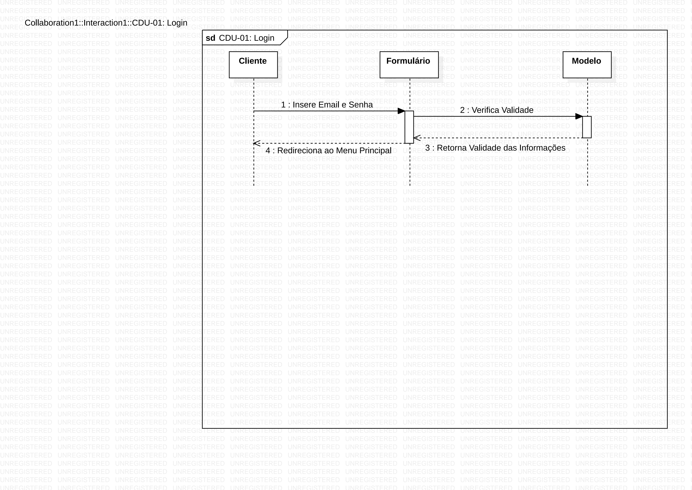
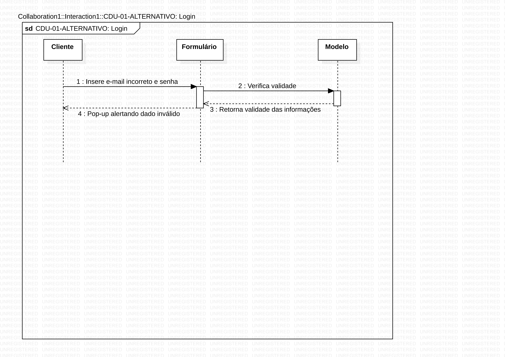

**Fluxo Principal**

1. Usuário insere o email corretamente
2. Usuário insere a senha corretamente
3. Usuário pressiona o botão "Entrar"
4. Usuário é redirecionado ao menu principal.

**Fluxo Alternativo A**

1. Usuário insere o email incorretamente
2. Usuário insere a senha corretamente
3. Usuário pressiona o botão "Entrar"
4. Um pop-up aparece com a mensagem "Senha e/ou Email incorreto(s)"
5. A página atualiza com os campos de email e senha em branco.

**Fluxo Alternativo B**

1. Usuário insere o email corretamente
2. Usuário insere a senha incorretamente
3. Usuário pressiona o botão "Entrar"
4. Um pop-up aparece com a mensagem "Senha e/ou Email incorreto(s)"
5. A página atualiza com os campos de email e senha em branco.

### CDU 02

Usuário se cadastra no site

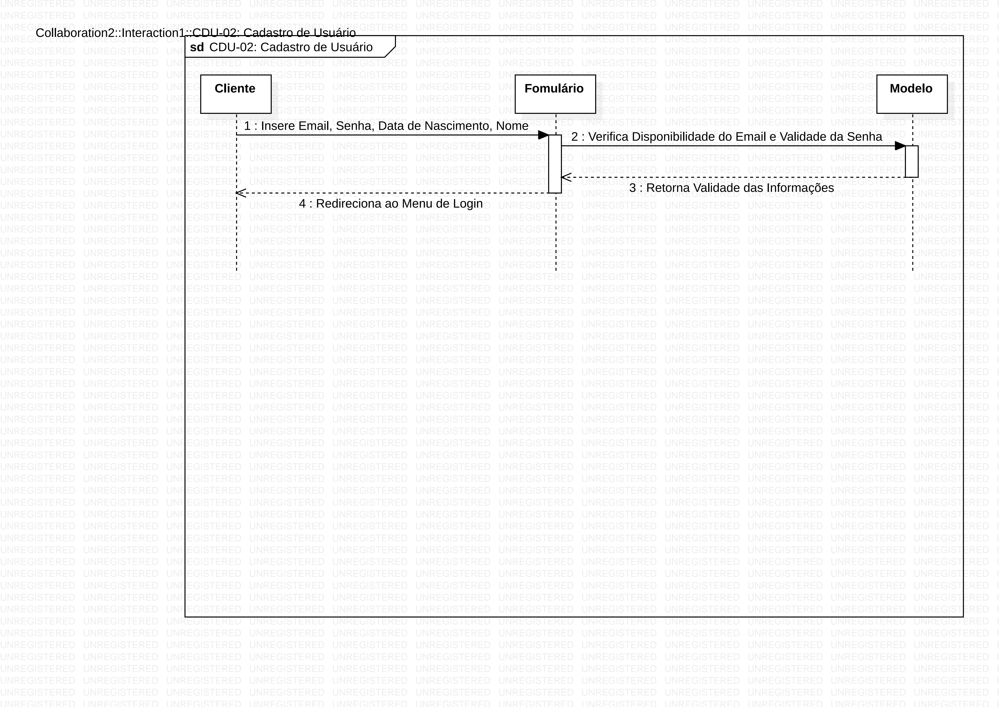
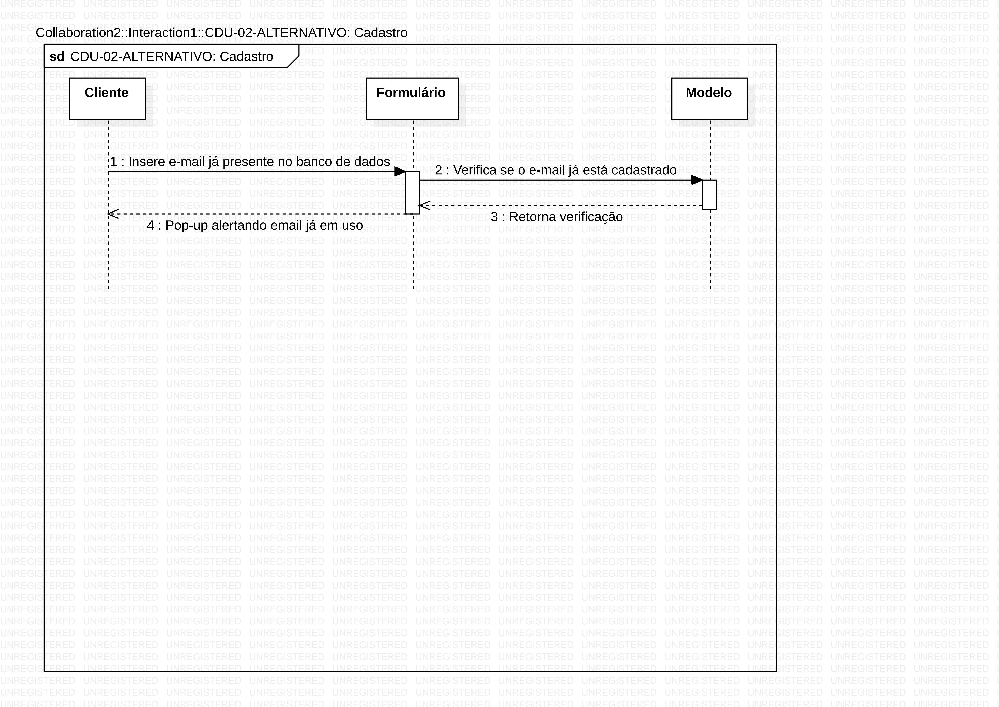

**Fluxo Principal**

1. Usuário pressiona o botão "Registrar-se"
2. O usuário preenche o campo "E-mail" com um e-mail não presente no banco de dados do programa
3. O programa verifica a presença do e-mail no banco de dados
4. O programa retorna a mensagem "E-mail disponível"
5. Usuário preenche o campo "Senha" com um texto com pelo menos 8 caracteres e símbolos especiais presentes no charset "UTF-8"
6. O programa verifica se a senha possui pelo menos 8 caracteres e não possui símbolos especiais inválidos
7. O programa retorna a mensagem "Senha válida"
8. Usuário preenche o campo "Nome" com seu nome completo
9. Usuário preenche o campo "Data de Nascimento" com sua data de nascimento na formatação DD/MM/YY
10. Usuário pressiona botão "Registrar"
11. As informações inseridas pelo usuário são enviadas ao banco de dados
12. Usuário é redirecionado à página de login.

**Fluxo Alternativo A**

1. Usuário pressiona o botão "Registrar-se"
2. O usuário preenche o campo "E-mail" com um e-mail presente no banco de dados do programa
3. O programa verifica a presença do e-mail no banco de dados
4. O programa retorna a mensagem "E-mail já em uso"
5. A página é atualizada com o campo "E-mail" em branco.

**Fluxo Alternativo B**

1. Usuário pressiona o botão "Registrar-se"
2. O usuário preenche o campo "E-mail" com um e-mail não presente no banco de dados do programa
3. O programa verifica a presença do e-mail no banco de dados
4. O programa retorna a mensagem "E-mail disponível"
5. Usuário preenche o campo "Senha" com um texto com menos de 8 caracteres
6. O programa verifica se a senha possui pelo menos 8 caracteres e não possui símbolos especiais inválidos
7. O programa retorna a mensagem "Senha inválida"
8. A página é atualizada com o campo "Senha" em branco.

**Fluxo Alternativo C**

1. Usuário pressiona o botão "Registrar-se"
2. O usuário preenche o campo "E-mail" com um e-mail não presente no banco de dados do programa
3. O programa verifica a presença do e-mail no banco de dados
4. O programa retorna a mensagem "E-mail disponível"
5. Usuário preenche o campo "Senha" com um texto com menos de 8 caracteres e com símbolos especiais não presentes no charset "UTF-8"
6. O programa verifica se a senha possui pelo menos 8 caracteres e não possui símbolos especiais inválidos
7. O programa retorna a mensagem "Senha inválida"
8. A página é atualizada com o campo "Senha" em branco.

### CDU 03

Usuário reserva um horário para levar seu cachorro ao hotel

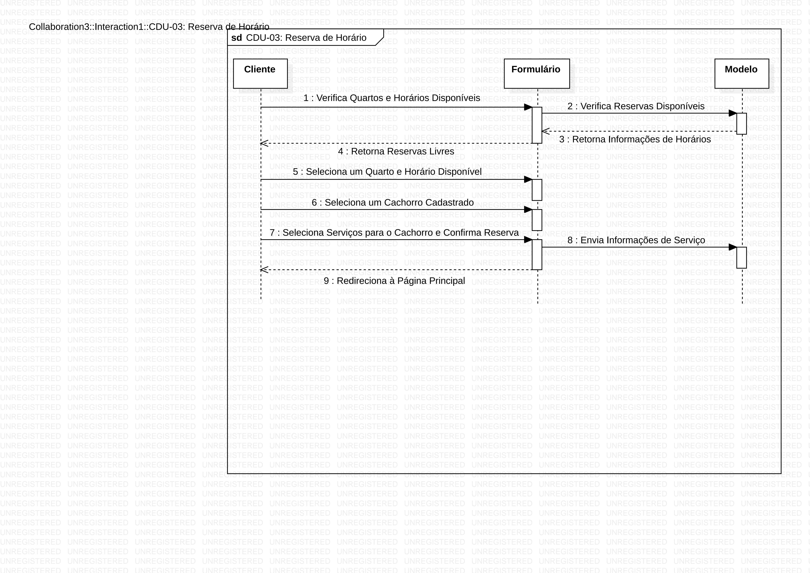
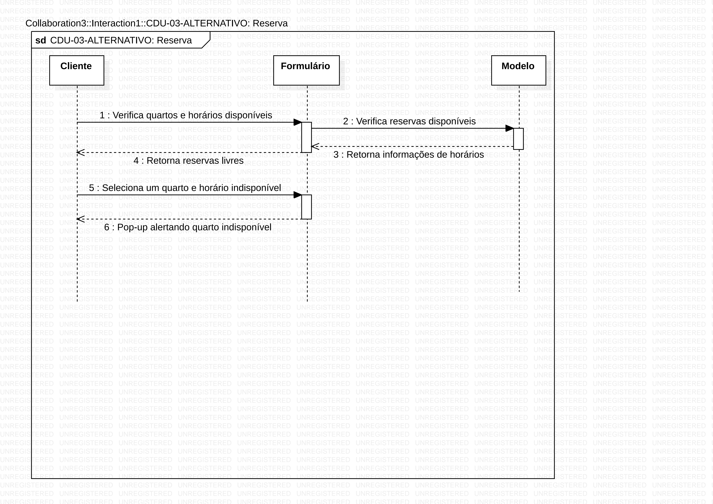

**Fluxo Principal**

1. Usuário pressiona o botão "Reservar"
2. Usuário é redirecionado a um calendário onde escolhe os dias que pretende reservar
3. O programa verifica os dias selecionados
4. O programa retorna os quartos da hotelaria, onde os quartos com horários disponíveis coloridos em verde e os quartos sem horários disponíveis coloridos em vermelho
5. Usuário seleciona um dos quartos com horários disponíveis no dia selecionado
6. O programa retorna os horários disponíveis no quarto selecionado
7. Usuário seleciona um dos horários disponíveis
8. Usuário seleciona um dos cachorros cadastrados por ele para a reserva
9. Usuário seleciona os serviços para o cachorro
10. Usuário pressiona o botão "Confirmar Reserva" 
11. Um pop-up aparece com a mensagem "Tem certeza que deseja confirmar a reserva?"
12. Usuário pressiona o botão "Sim"
13. Usuário é redirecionado ao menu principal
14. Um pop-up aparece com a mensagem "Reserva confirmada com sucesso.".

**Fluxo Alternativo A**

1. Usuário pressiona o botão "Reservar"
2. Usuário é redirecionado a um calendário onde escolhe os dias que pretende reservar
3. O programa verifica os dias selecionados
4. O programa retorna os quartos da hotelaria: os quartos com horários disponíveis coloridos em verde e os quartos sem horários disponíveis coloridos em vermelho
5. Usuário seleciona um dos quartos sem horários disponíveis no dia selecionado
6. Um pop-up aparece com a mensagem "Esse quarto não está disponível".

**Fluxo Alternativo B**

1. Usuário pressiona o botão "Reservar"
2. Usuário é redirecionado a um calendário onde escolhe os dias que pretende reservar
3. O programa verifica os dias selecionados
4. O programa retorna os quartos da hotelaria: os quartos com horários disponíveis coloridos em verde e os quartos sem horários disponíveis coloridos em vermelho
5. Usuário seleciona um dos quartos com horários disponíveis no dia selecionado
6. O programa retorna os horários disponíveis no quarto selecionado
7. Usuário seleciona um dos horários indisponíveis
8. Um pop-up aparece com a mensagem "Esse horário não está disponível"

### CDU 04

Usuário cadastra seu cachorro para fazer uma futura reserva

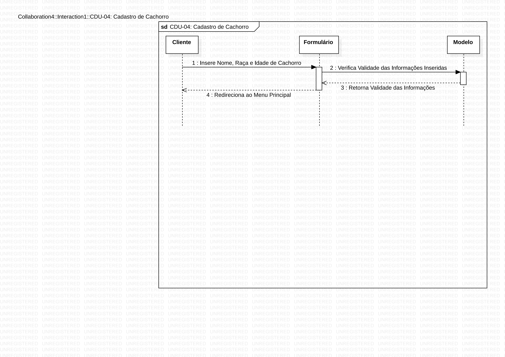
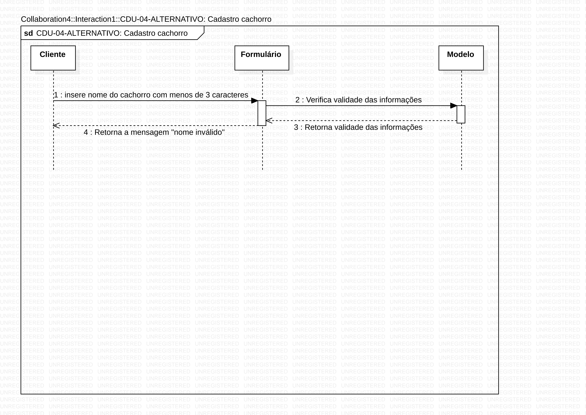

**Fluxo Principal**

1. No menu principal, usuário pressiona o botão "Registrar Cachorro"
2. O usuário preenche o campo "Nome do Dog" com um texto de pelo menos 3 caracteres e sem caracteres especiais
3. O programa verifica se o texto possui 3 caracteres ou mais e não possui caracteres especiais
4. O programa retorna a mensagem "Nome válido"
5. Usuário preenche o campo "Raça do Dog" com um texto com pelo menos 4 caracteres e sem caracteres especiais
6. O programa verifica se o texto possui 4 caracteres ou mais e não possui caracteres especiais
7. O programa retorna a mensagem "Raça válida"
8. Usuário preenche o campo "Idade do Dog" com um numeral
9. O programa verifica se o texto só possui numerais 
10. Usuário pressiona botão "Registrar"
11. As informações inseridas pelo usuário são enviadas ao banco de dados
12. Usuário é redirecionado ao menu principal.

**Fluxo Alternativo A**

1. No menu principal, usuário pressiona o botão "Registrar Cachorro" 
2. O usuário preenche o campo "Nome do Dog" com um texto com menos de 3 caracteres e sem caracteres especiais 
3. O programa verifica se o texto possui 3 caracteres ou mais e não possui caracteres especiais 
4. O programa retorna a mensagem "Nome inválido"

**Fluxo Alternativo B**

1. No menu principal, usuário pressiona o botão "Registrar Cachorro" 
2. O usuário preenche o campo "Nome do Dog" com um texto com pelo menos 3 caracteres com caracteres especiais 
3. O programa verifica se o texto possui 3 caracteres ou mais e não possui caracteres especiais 
4. O programa retorna a mensagem "Nome inválido" 

**Fluxo Alternativo C**

1. No menu principal, usuário pressiona o botão "Registrar Cachorro" 
2. O usuário preenche o campo "Nome do Dog" com um texto com pelo menos 3 caracteres e sem caracteres especiais 
3. O programa verifica se o texto possui 3 caracteres ou mais e não possui caracteres especiais 
4. O programa retorna a mensagem "Nome válido" 
5. Usuário preenche o campo "Raça do Dog" com um texto com menos de 4 caracteres e sem caracteres especiais 
6. O programa verifica se o texto possui 4 caracteres ou mais e não possui caracteres especiais 
7. O programa retorna a mensagem "Raça inválida" 

**Fluxo Alternativo D**

1. No menu principal, usuário pressiona o botão "Registrar Cachorro" 
2. O usuário preenche o campo "Nome do Dog" com um texto com pelo menos 3 caracteres e sem caracteres especiais 
3. O programa verifica se o texto possui 3 caracteres ou mais e não possui caracteres especiais 
4. O programa retorna a mensagem "Nome válido" 
5. Usuário preenche o campo "Raça do Dog" com um texto com pelo menos 4 caracteres com caracteres especiais 
6. O programa verifica se o texto possui 4 caracteres ou mais e não possui caracteres especiais 
7. O programa retorna a mensagem "Raça inválida"

### CDU 05

Administrado e Funcionário apagam uma reserva previamente ocupada

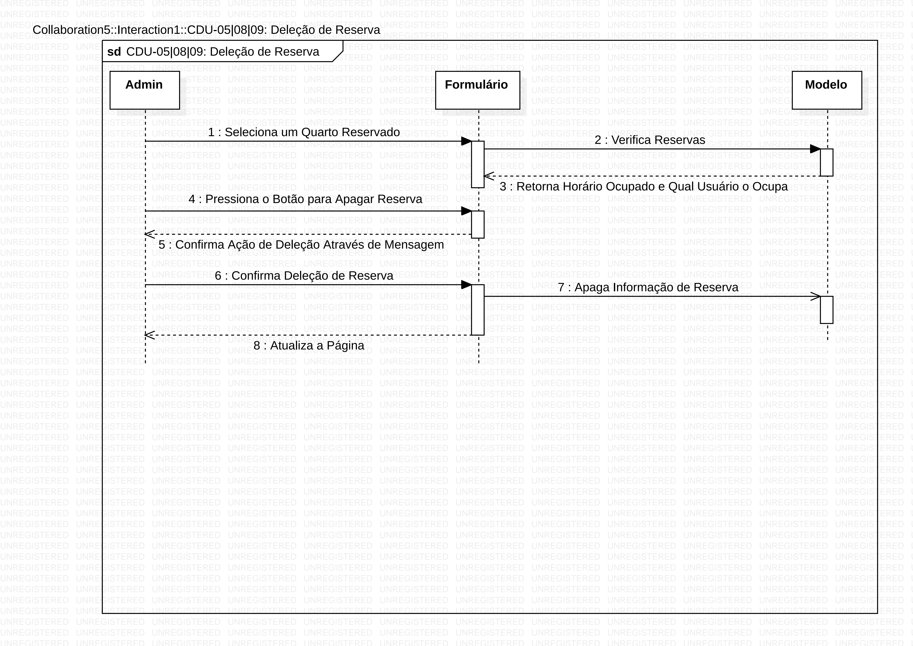
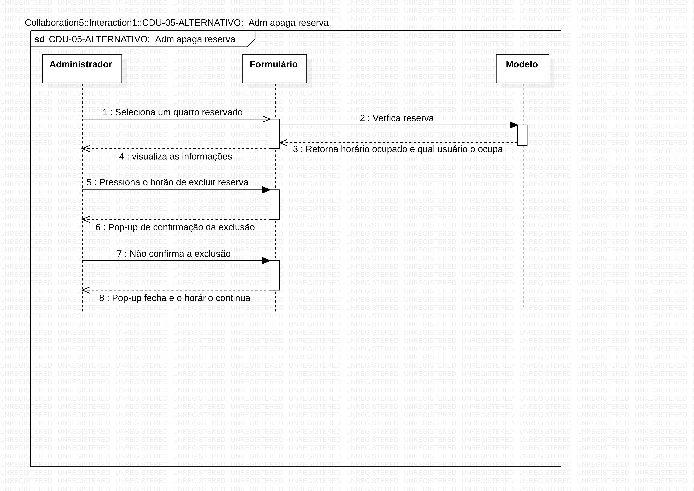

**Fluxo principal**

1. No menu principal, o administrador pressiona o botão "Gerenciar Reservas"
2. Administrador é redirecionado a uma página com os quartos e horários em que o hotel funciona: os quartos com horários disponíveis coloridos em verde e os quartos sem horários disponíveis coloridos em vermelho
3. Administrador seleciona um quarto colorido em vermelho
4. Administrador visualiza os horários ocupados e quais usuários os ocuparam
5. Administrador pressiona o botão em forma de X para apagar uma reserva de horário previamente feita 
6. Um pop-up aparece com a mensagem "Tem certeza que deseja apagar essa reserva?"
7. Administrador pressiona o botão "Sim" no pop-up
8. A página atualiza, com o horário escolhido não mais reservado

**Fluxo Alternativo A**

1. No menu principal, o administrador pressiona o botão "Gerenciar Reservas"
2. Administrador é redirecionado a uma página com os quartos e horários em que o hotel funciona, onde os quartos com horários disponíveis coloridos em verde e os quartos sem horários disponíveis coloridos em vermelho
3. Administrador seleciona um quarto colorido em vermelho
4. Administrador visualiza os horários ocupados e quais usuários os ocuparam
5. Administrador pressiona o botão em forma de X para apagar uma reserva de horário previamente feita 
6. Um pop-up aparece com a mensagem "Tem certeza que deseja apagar essa reserva?"
7. Administrador pressiona o botão "Não" no pop-up
8. O pop-up fecha com o horário escolhido inalterado

### CDU 06

Cliente consulta os horários reservados

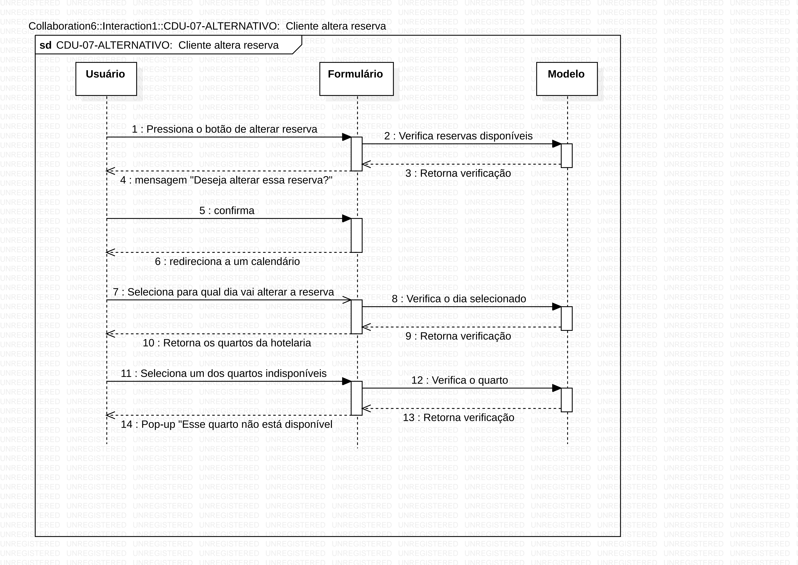

**Fluxo principal**

1. No menu principal, usuário pressiona botão "Reservas"
2. Usuário é redirecionado a uma listagem com as informações de quartos e horários reservados por ele, e os cachorros selecionados

### CDU 07

Cliente altera a reserva

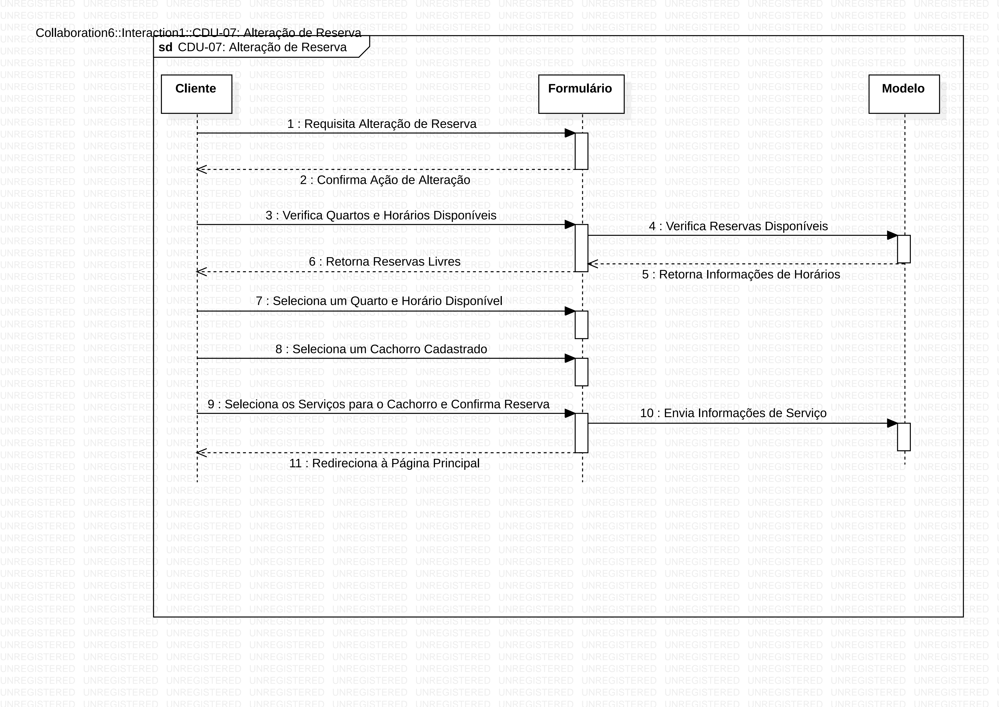
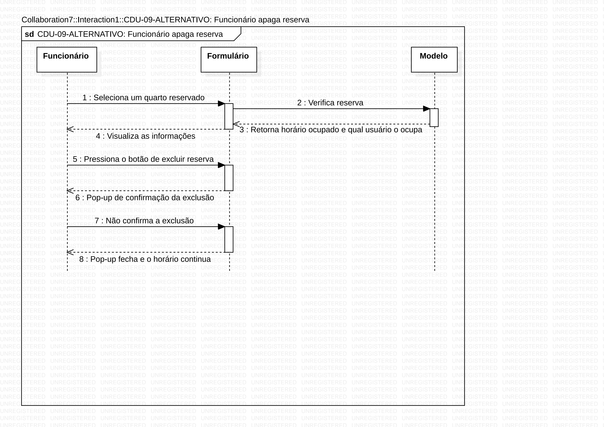

**Fluxo principal**

1. No menu principal, usuário pressiona botão "Reservas"
2. Usuário é redirecionado a uma listagem com as informações do(s) quarto(s) e horário(s) reservado(s) por ele para seu(s) respectivo(s) cachorro(s)
3. Usuário pressiona o botão "Alterar" ao lado da reserva que deseja alterar
4. Um pop-up aparece com a mensagem "Tem certeza que deseja alterar essa reserva?"
5. Usuário pressiona botão "Sim"
6. Usuário é redirecionado a um calendário onde escolhe para qual dia deseja alterar a reserva
7. O programa verifica os dias selecionados
8. O programa retorna os quartos da hotelaria: os quartos com horários disponíveis coloridos em verde e os quartos sem horários disponíveis coloridos em vermelho
9. Usuário seleciona um dos quartos com horários disponíveis no dia selecionado
10. O programa retorna os horários disponíveis no quarto selecionado
11. Usuário seleciona um dos horários disponíveis
12. Usuário seleciona um dos cachorros cadastrados por ele para a reserva
13. Usuário seleciona os serviços para o cachorro
14. Usuário pressiona o botão "Confirmar Reserva"
15. Um pop-up aparece com a mensagem "Tem certeza que deseja confirmar a reserva?"
16. Usuário pressiona o botão "Sim"
17. Usuário é redirecionado ao menu principal
18. Um pop-up aparece com a mensagem "Reserva alterada com sucesso.".

**Fluxo alternativo A**

1. No menu principal, usuário pressiona botão "Reservas"
2. Usuário é redirecionado a uma listagem com as informações do(s) quarto(s) e horário(s) reservado(s) por ele para seu(s) respectivo(s) cachorro(s)
3. Usuário pressiona o botão "Alterar" ao lado da reserva que deseja alterar
4. Um pop-up aparece com a mensagem "Tem certeza que deseja alterar essa reserva?"
5. Usuário pressiona botão "Não"
6. O pop-up fecha com a reserva escolhida inalterada.

**Fluxo alternativo B**

1. No menu principal, usuário pressiona botão "Reservas"
2. Usuário é redirecionado a uma listagem com as informações do(s) quarto(s) e horário(s) reservado(s) por ele para seu(s) respectivo(s) cachorro(s)
3. Usuário pressiona o botão "Alterar" ao lado da reserva que deseja alterar
4. Um pop-up aparece com a mensagem "Tem certeza que deseja alterar essa reserva?"
5. Usuário pressiona botão "Sim"
6. Usuário é redirecionado a um calendário onde escolhe para qual dia deseja alterar a reserva
7. O programa verifica os dias selecionados
8. O programa retorna os quartos da hotelaria: os quartos com horários disponíveis coloridos em verde e os quartos sem horários disponíveis coloridos em vermelho
9. Usuário seleciona um dos quartos sem horários disponíveis no dia selecionado
10. Um pop-up aparece com a mensagem "Esse quarto não está disponível".

**Fluxo alternativo C**

1. No menu principal, usuário pressiona botão "Reservas"
2. Usuário é redirecionado a uma listagem com as informações do(s) quarto(s) e horário(s) reservado(s) por ele para seu(s) respectivo(s) cachorro(s)
3. Usuário pressiona o botão "Alterar" ao lado da reserva que deseja alterar
4. Um pop-up aparece com a mensagem "Tem certeza que deseja alterar essa reserva?"
5. Usuário pressiona botão "Sim"
6. Usuário é redirecionado a um calendário onde escolhe para qual dia deseja alterar a reserva
7. O programa verifica os dias selecionados
8. O programa retorna os quartos da hotelaria: os quartos com horários disponíveis coloridos em verde e os quartos sem horários disponíveis coloridos em vermelho
9. Usuário seleciona um dos quartos com horários disponíveis no dia selecionado
10. O programa retorna os horários disponíveis no quarto selecionado
11. Usuário seleciona um dos horários indisponíveis
12. Um pop-up aparece com a mensagem "Esse horário não está disponível"

### CDU 08

Cliente cancela uma reserva

1. No menu principal, usuário pressiona botão "Reservas"
2. Usuário é redirecionado a uma listagem com as informações de quartos e horários reservados por ele, e os cachorros selecionados
3. Usuário pressiona o botão "X" ao lado da reserva que deseja apagar
4. Um pop-up aparece com a mensagem "Tem certeza que deseja apagar essa reserva?"
5. Usuário pressiona botão "Sim"
6. A reserva é apagada no banco de dados
7. A página é atualizada e a reserva selecionada é apagada.

### CDU 09 

Funcionário e cliente recuperaram a senha.

**Fluxo Principal**

1. O usuário seleciona a opção "Recuperar a senha "
2. O sistema retornará a um Pop-up com um formulário que solicitará o e-mail de recuperação.
3. O usuário digita o email de recuperação e seleciona "receber código de confirmação".
4. O sistema recebe os dados e retorna o código de confirmação para o e-mail do usuário".
5. O sistema retornará um Pop-up que solicitará o código de confirmação.
6. O usuário digita o código certo e clica em "confirmar".

**Fluxo Alternativo A**

1. O usuário seleciona a opção "Recuperar a senha "
2. O sistema retornará a um Pop-up com um formulário que solicitará o e-mail de recuperação.
3. O usuário digita o email incorretamente e seleciona "receber código de confirmação".
4. O sistema retorna a mensagem "e-mail de recuperação incorreto".

**Fluxo Alternativo B**

1. O usuário seleciona a opção "Recuperar a senha "
2. O sistema retornará a um Pop-up com um formulário que solicitará o e-mail de recuperação.
3. O usuário digita o email de recuperação e seleciona "receber código de confirmação".
4. O sistema recebe os dados e retorna o código de confirmação para o e-mail do usuário".
5. O sistema retornará um Pop-up que solicitará o código de confirmação.
6. O usuário digita o código incorretamente e clica em "confirmar".
7. O sistema retorna a mensagem "código de confirmação incorreto".
